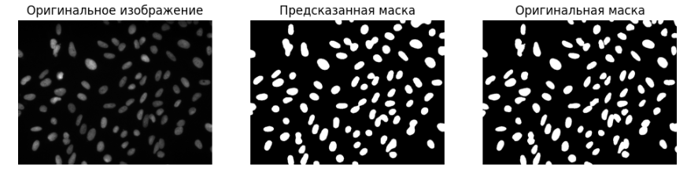
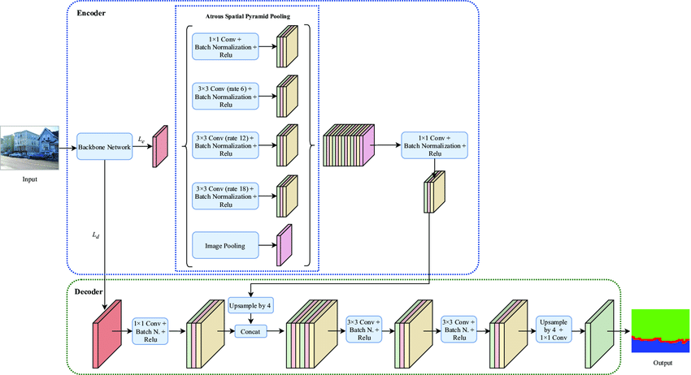
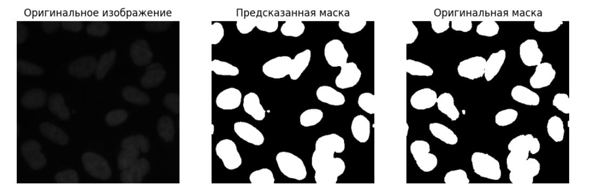
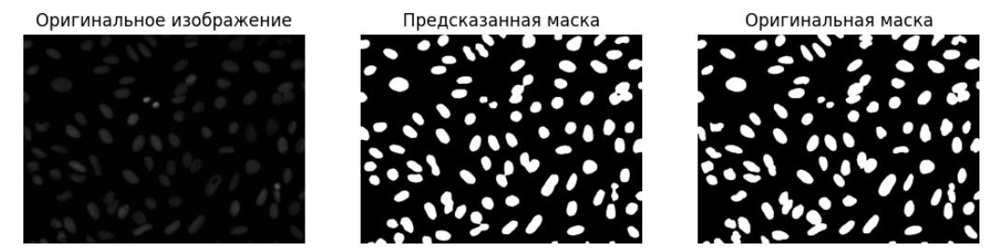
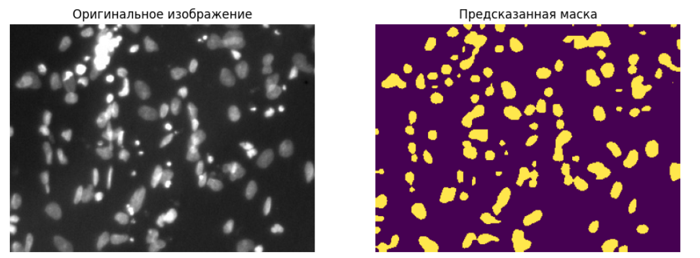
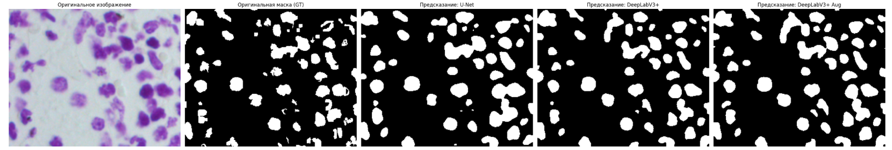
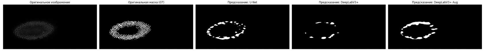

# Задача Сегментации ядер клеток с помощью моделей на основе архетикутр U-Net и DeepLabv3+
Cell nucleus segmentation by two models with  architecture: U-Net and DeepLabv3+  
## Архитектура U-Net

Модель обучалась 20 эпох: 
Validation Accuracy: 87.93% 
Validation Dice Score: 0.8805
## Пример работы модели

## Архитектура DeepLabv3+

Модель обучалась 15 эпох: 
Validation Accuracy: 97.23% 
Validation Dice Score: 0.9020
## Пример работы модели

 
  

**Пример на тестовых изображениях** 
 

## Сравнение моделей
  
 